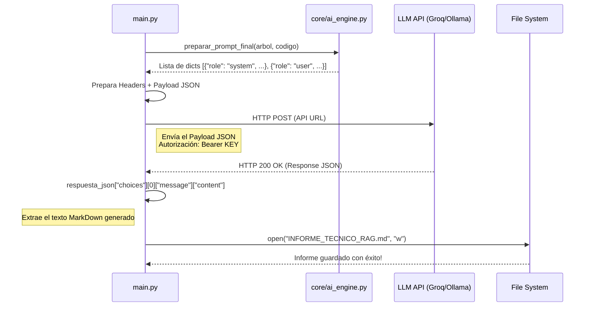

# Explicación del Proyecto: Generador de Documentos con LLM

Este documento proporciona una visión general y estructurada de las partes fundamentales del repositorio y de cómo se comunican las distintas piezas de código con el modelo de lenguaje (LLM).

## Partes Más Importantes del Proyecto

El proyecto se estructura en un script principal y un motor compuesto por varios módulos en el directorio `core/`.

1. **`main.py` (Script de Orquestación)**:
   - Carga la configuración (variables de entorno como `OLLAMA_BASE_URL` o `GROQ_API_KEY`) y configura cuál modelo usar.
   - Orquesta el trabajo en 4 fases: Generar Árbol, Compilar Código, Preparar Prompt y Llamar a la IA.
   - Extrae la respuesta de la red y guarda el documento técnico resultante (`INFORME_TECNICO_RAG.md`).

2. **`core/tree_generator.py` (Fase 1: Generación de Estructura)**:
   - Examina el directorio de un proyecto objetivo (por ejemplo, `Arquitectura_Rag_con_LLM`) para generar un mapa o árbol de jerarquía de ficheros visual.

3. **`core/reader.py` (Fase 2: Extracción y Compilación de Código)**:
   - Lee todo el código fuente del proyecto, junta el contenido dentro de un formato estructurado y calcula (o estima) cuántos tokens va a consumir en base al tamaño de la cadena de texto, para no sobrepasar el contexto del LLM.

4. **`core/ai_engine.py` (Fase 3: Construcción de Prompts)**:
   - Es el motor de instrucciones del asistente virtual. Contiene el diccionario `SECCIONES` que establece la estructura final (Abstract, Herramientas, Funciones detalladas, etc.).
   - Elabora el mensaje final de contexto ("System Prompt" con reglas y secciones, y "User Prompt" con el código fuente y el árbol de estructura).

---

## Esquema del Proceso de Envío del Mensaje al LLM y Retorno JSON

La comunicación real de la aplicación con la Inteligencia Artificial (focalizado en el estándar compatible de OpenAI que usan Groq/Ollama) sigue estos pasos principales usando el protocolo HTTP y mensajes en formato JSON:

### 1. Construcción del Payload (Envío de Datos)

El agente construye una lista de diccionarios en Python que luego se transforma en la clave `"messages"` dentro de una estructura o "payload" JSON:

```json
{
  "model": "llama-3.3-70b-versatile",
  "temperature": 0.2,
  "messages": [
    {
      "role": "system",
      "content": "Instrucciones base, reglas y esquema de secciones (Abstract, Mejores...)."
    },
    {
      "role": "user",
      "content": "### ESTRUCTURA ###\n... \n### CODIGO ###\n..."
    }
  ]
}
```

### 2. Flujo Completo (Diagrama)



### 3. Parseo del Retorno JSON

Una vez que el LLM genera la respuesta, el servidor retorna el resultado en este formato JSON exacto:

```json
{
  "id": "chatcmpl-1234",
  "object": "chat.completion",
  "created": 1677652288,
  "model": "llama-3.3-70b-versatile",
  "choices": [
    {
      "index": 0,
      "message": {
        "role": "assistant",
        "content": "# INFORME TECNICO...\n\n## 1. Abstract\nEste proyecto es..."
      },
      "finish_reason": "stop"
    }
  ],
  "usage": {
    "prompt_tokens": 4032,
    "completion_tokens": 1500,
    "total_tokens": 5532
  }
}
```

Como se aprecia en la fase de código `informe_generado = respuesta_json["choices"][0]["message"]["content"]`, el script de Python navega hasta ese nodo del JSON, extrae específicamente todo el texto plano escrito en formato Markdown que el modelo ha elaborado, y por último lo vierte en el archivo `INFORME_TECNICO_RAG.md`.
