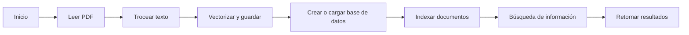

## 1. Abstract

El archivo proporcionado es el núcleo de un sistema de "Memoria a Largo Plazo" para una IA, denominado RAG (Retrieval-Augmented Generation). Su función principal es transformar documentos PDF estáticos en una base de datos semántica, permitiendo la búsqueda de información por significado y no solo por palabras clave. El proceso se divide en tres pasos: leer el texto plano del PDF, trocear el texto en fragmentos pequeños para su procesamiento, y vectorizar y guardar estos fragmentos en una base de datos llamada ChromaDB. La base de datos se crea o carga según sea necesario, y se utiliza para indexar y buscar información en los documentos PDF. El sistema también cuenta con una función de búsqueda que permite encontrar los párrafos del PDF más relacionados con una consulta dada.

El archivo incluye varias clases y funciones auxiliares, como la clase `RecursiveChunker` para dividir el texto en trozos manejables, y la función `cargar_pdf` para leer el texto de un archivo PDF. La función principal `inicializar_rag` es el punto de entrada del sistema, y se encarga de configurar la base de datos, indexar los documentos PDF y crear la colección de datos. La función `buscar_contexto` se utiliza para buscar información en la base de datos y retornar un texto único con la información encontrada.

En resumen, el archivo proporcionado es un sistema de gestión de información que permite transformar documentos PDF en una base de datos semántica y buscar información de manera eficiente.

## 2. Diagrama Lógico



El diagrama lógico muestra el flujo de procesos del sistema, desde la lectura del PDF hasta la búsqueda de información y el retorno de resultados.

## 3. Explicación del proceso

### Paso 1: Leer PDF

La función `cargar_pdf` se utiliza para leer el texto de un archivo PDF. Esta función utiliza la biblioteca `pypdf` para extraer el texto de cada página del PDF y concatenarlo en un solo string.

```python
def cargar_pdf(ruta_archivo):
    if not os.path.exists(ruta_archivo):
        print(f"Error: El archivo {ruta_archivo} no existe en la carpeta.")
        return None
    reader = PdfReader(ruta_archivo)
    texto = ""
    for page in reader.pages:
        extracted = page.extract_text()
        if extracted: texto += extracted + "\n"
    return texto
```

### Paso 2: Trocear texto

La clase `RecursiveChunker` se utiliza para dividir el texto en trozos manejables. Esta clase utiliza un algoritmo recursivo para dividir el texto en fragmentos pequeños, teniendo en cuenta el tamaño máximo permitido y el solapamiento entre fragmentos.

```python
class RecursiveChunker:
    def __init__(self, chunk_size=1000, chunk_overlap=100, separators=None):
        self.chunk_size = chunk_size
        self.chunk_overlap = chunk_overlap
        self.separators = separators or ["\n\n", "\n", " ", ""]

    def split_text(self, text):
        return self._split_text_recursive(text, self.separators)
```

### Paso 3: Vectorizar y guardar

La función `inicializar_rag` se utiliza para vectorizar y guardar los fragmentos de texto en la base de datos. Esta función utiliza la biblioteca `chromadb` para crear o cargar la base de datos, y la biblioteca `sentence-transformers` para vectorizar los fragmentos de texto.

```python
def inicializar_rag(lista_pdfs):
    # Configurar el "Traductor a Números" (Embedding Function)
    emb_fn = embedding_functions.SentenceTransformerEmbeddingFunction(model_name="all-MiniLM-L6-v2")
    
    # Conectar a la Base de Datos (Persistente en disco)
    client = chromadb.PersistentClient(path="./chroma_db")
    
    # Obtener o Crear la Colección 
    collection = client.get_or_create_collection(name="mi_base_vectorial", embedding_function=emb_fn, metadata={"hnsw:space": "cosine"})

    # Indexado de documentos
    for pdf in lista_pdfs:
        # Verificamos si ESTE archivo específico ya está indexado usando metadatos
        existing = collection.get(where={"source": pdf}, limit=1)
        
        if len(existing['ids']) == 0: 
            print(f"Indexando nuevo documento: {pdf}...")
            texto = cargar_pdf(pdf)

            if texto:
                # 2. Trocear texto
                chunker = RecursiveChunker(chunk_size=1000, chunk_overlap=200)
                chunks = chunker.split_text(texto)
                
                # 3. Preparar metadatos e IDs
                ids = [str(uuid.uuid4()) for _ in range(len(chunks))]
                metadatos = [{"source": pdf} for _ in range(len(chunks))]
                
                # 4. Guardar en ChromaDB
                collection.add(documents=chunks, metadatas=metadatos, ids=ids)
                print(f"Indexación completada: {len(chunks)} fragmentos de {pdf}.")
            else:
                print(f"ERROR: No se pudo leer {pdf}. Asegúrate de que el archivo existe.")
        else:
            print(f"{pdf} ya está indexado en la base de datos.")
    
    return collection
```

### Paso 4: Búsqueda de información

La función `buscar_contexto` se utiliza para buscar información en la base de datos. Esta función utiliza la biblioteca `chromadb` para buscar los fragmentos de texto más relacionados con la consulta dada.

```python
def buscar_contexto(collection, query):
    resultados = collection.query(query_texts=[query], n_results=3)
    
    contexto_formateado = ""
    
    if resultados['documents'] and resultados['documents'][0]:
        for doc, meta in zip(resultados['documents'][0], resultados['metadatas'][0]):
            fuente = meta.get('source', 'Desconocido')
            contexto_formateado += f"--- Fuente: {fuente} ---\n{doc}\n\n"
        return contexto_formateado
        
    return "No se encontró información relevante en los documentos."
```

## 4. Librerías utilizadas

* `pypdf`: para leer el texto de los archivos PDF
* `chromadb`: para crear y gestionar la base de datos
* `sentence-transformers`: para vectorizar los fragmentos de texto
* `uuid`: para generar IDs únicos para los fragmentos de texto

## 5. Puntos críticos y vulnerabilidades

1. **Seguridad**: La base de datos se almacena en un archivo en el disco, lo que puede ser un problema de seguridad si no se toman medidas adecuadas para protegerla.
 * Solución: Utilizar un sistema de autenticación y autorización para controlar el acceso a la base de datos.
2. **Manejo de excepciones**: La función `inicializar_rag` no maneja adecuadamente las excepciones que pueden ocurrir durante el proceso de indexado.
 * Solución: Agregar un bloque `try-except` para manejar las excepciones y proporcionar un mensaje de error adecuado.
3. **Límites de tokens**: La función `buscar_contexto` puede devolver un número limitado de resultados, lo que puede no ser suficiente para algunas consultas.
 * Solución: Agregar un parámetro `n_results` a la función `buscar_contexto` para permitir al usuario especificar el número de resultados que desea obtener.